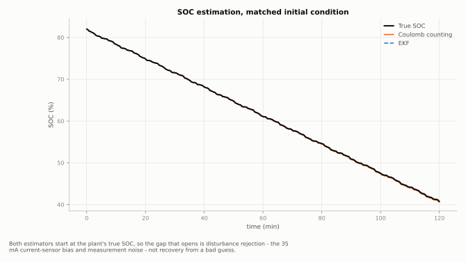
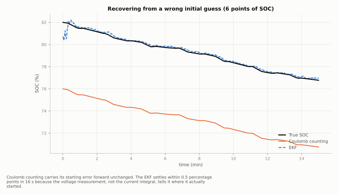
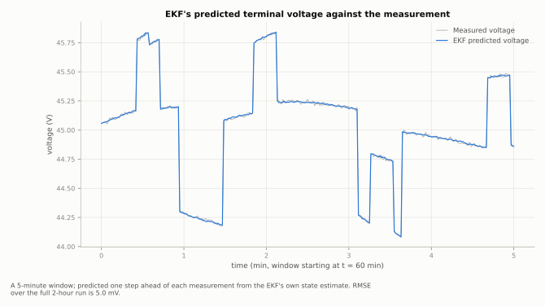

# Li-Ion Battery SOC Estimation — Coulomb Counting vs. Extended Kalman Filter

A reproducible Python study of estimating the state of charge (SOC) of a
lithium-ion battery from current and terminal-voltage measurements: a
first-order Thevenin equivalent-circuit model, a realistic flat-plateau OCV
curve, Coulomb counting, and a two-state Extended Kalman Filter, measured
against each other rather than asserted.

Everything runs on a laptop. No hardware, no cell data, no lab.

<picture>
  <source media="(prefers-color-scheme: dark)" srcset="results/soc_comparison_dark.svg">
  
</picture>

## The three results

**1. With a correct model and a known starting point, both estimators are
already accurate** (RMSE 0.108 % for Coulomb counting, 0.111 % for the EKF,
over a 2-hour drive cycle with a realistic 35 mA current-sensor bias). The
EKF is not "better" here — this run isolates disturbance rejection, and the
disturbance is small. Reporting this scenario alone, the way an earlier
version of this project did, overstates the EKF's advantage.

**2. Coulomb counting can never correct a wrong initial guess. The EKF fixes
one in seconds.** Starting six points of SOC off true (a realistic situation
after a rest period or an uncertain charge-termination point):

| Estimator | Initial error | Settles within 0.5 pp |
|---|---|---|
| Coulomb counting | 6.00 pp | never |
| EKF | 1.28 pp | 16 s |

<picture>
  <source media="(prefers-color-scheme: dark)" srcset="results/convergence_dark.svg">
  
</picture>

**3. The EKF's accuracy is only as good as its model of the battery, and
Coulomb counting is exactly immune to the errors that hurt the EKF most.**

| Scenario | Coulomb counting RMSE | EKF RMSE |
|---|---|---|
| Exact model | 0.113 % | 0.110 % |
| Capacity known 5 % low | 1.431 % | 0.104 % |
| R0 known 20 % high | 0.113 % | 3.369 % |
| OCV table off by 50 mV | 0.113 % | 1.104 % |
| All three combined | 1.431 % | 2.353 % |

Coulomb counting never looks at voltage, R0, or the OCV table, so a wrong one
changes nothing for it — its only exposure is capacity and current bias. The
EKF trades that blind spot for a new one: it is far more sensitive to a
wrong series resistance or a wrong OCV table than to a wrong capacity. Which
estimator wins depends on which parameter you trust least, not on which
algorithm sounds more sophisticated.

## Why the OCV curve has a flat plateau

<picture>
  <source media="(prefers-color-scheme: dark)" srcset="results/voltage_fit_dark.svg">
  
</picture>

The pack's open-circuit voltage rises about 4.2 V per unit SOC through the
middle of the range and about 20-24 V per unit SOC at the two knees near
empty and full. This is deliberate and is what makes the estimation problem
realistic: through most of a real cell's usable range, voltage is a weak
clue to SOC, and it is the terminal-voltage feedback near the knees, not the
flat middle, that gives the EKF most of what it knows. A model with a steep
mid-range slope (an earlier version of this one had it backwards) makes SOC
trivial to read off voltage everywhere, which is not how a real Li-ion or
LFP pack behaves.

## The model

```text
       R0
  ───/\/\/───┬──── Vterm
             │
        ┌────┴────┐
        │          │
       Rp          │
        │          │
        Cp         │
        │          │
        └────┬─────┘
             │
          OCV(SOC)
```

Rp and Cp are in **parallel** with each other, and that pair is in series
with R0 between the OCV source and the terminal.

Terminal voltage:

```math
V_t = \mathrm{OCV}(\mathrm{SOC}) - I R_0 - V_{RC}
```

RC polarization state:

```math
V_{RC,k+1} = a\,V_{RC,k} + R_p(1-a) I_k, \qquad a = e^{-\Delta t / (R_p C_p)}
```

SOC propagation, with coulombic efficiency applied only while charging
(current < 0 in this project's sign convention, where positive = discharge —
some of the charge pushed in during charging is lost to side reactions;
nothing is lost extracting charge that is already there):

```math
\mathrm{SOC}_{k+1} = \mathrm{SOC}_k - \frac{\eta(I_k)\, I_k \,\Delta t}{Q},
\qquad \eta(I) = \begin{cases} 1 & I \ge 0 \\ \eta_{\text{coulomb}} & I < 0 \end{cases}
```

## The EKF

State vector:

```math
x = \begin{bmatrix} \mathrm{SOC} \\ V_{RC} \end{bmatrix}
```

Measurement equation and its Jacobian:

```math
V_t = \mathrm{OCV}(\mathrm{SOC}) - I R_0 - V_{RC}, \qquad
H = \begin{bmatrix} \dfrac{d\,\mathrm{OCV}}{d\,\mathrm{SOC}} & -1 \end{bmatrix}
```

Prediction uses the same SOC and RC-voltage update as the plant; correction
uses the measured terminal voltage and a Joseph-form covariance update for
numerical symmetry. `docv_dsoc` is checked against a numerical derivative of
`ocv` in both `verify.py` and the test suite.

## Experiment

A 2-hour synthetic EV-style signed-current profile: low-current cruising,
acceleration pulses, regenerative-current pulses, rest periods. The
measurement layer adds Gaussian noise (0.05 A on current, 10 mV on voltage)
and a 35 mA current-sensor bias. The reference is the hidden plant SOC;
estimators only ever see measured current and measured voltage.

The primary comparison (`results/soc_comparison.svg`, `results/metrics.csv`)
starts both estimators at the plant's true SOC, so what it measures is
disturbance rejection, not recovery from a bad guess — that is a separate
study (`results/convergence.csv`), and conflating the two is what made the
first version of this project's headline number misleading.

## Verifying it

`verify.py` runs eleven checks and exits non-zero if any fail: the OCV
derivative against its own numerical derivative, monotonicity, the
plateau/knee slope ratio, the coulombic-efficiency asymmetry, reproducibility
from a fixed seed, the EKF's predicted voltage against the true (noise-free)
terminal voltage, both estimators' matched-model accuracy, the convergence
times in the table above, and the asymmetric model-mismatch sensitivities.

```
$ python3 verify.py
  [pass] dOCV/dSOC matches numerical derivative of OCV(SOC)
         max error 6.56e-09 (tol 1e-6)
  [pass] mid-SOC plateau slope is >3x flatter than the low-SOC knee
         mid 4.20 V/SOC, knee 24.20 V/SOC
  [pass] EKF is far more sensitive to R0 error than to capacity error
         EKF degradation: R0 +3.2589 pp vs capacity -0.0058 pp
  ...
11 checks passed, 0 failed
```

## Run it

```bash
pip install -r requirements.txt

python3 verify.py         # eleven checks, about 15 s
python3 make_figures.py   # rebuilds every figure and CSV, about 15 s
python3 -m unittest discover -s tests -v
```

Or run it in your browser with nothing installed: [](https://colab.research.google.com/github/fatinnihal532-hub/liion-soc-ekf/blob/main/run_in_colab.ipynb)

A single design, for experimenting:

```python
from src.battery_model import TheveninBattery, BatteryParams
from src.experiment import run_experiment

# give the EKF a wrong OCV table (a table 50 mV too high) and see it degrade
d = run_experiment(ocv_bias_v=0.05)
print(d["ekf_soc"][-1], d["true_soc"][-1])
```

## File layout

```text
src/battery_model.py   Thevenin plant: OCV curve, RC dynamics, coulomb rate
src/estimators.py      Coulomb counter and the two-state EKF
src/experiment.py      current profile, sensor model, one full run
src/robustness.py      convergence and model-mismatch studies
src/main.py            figures + results/*.csv
src/plotstyle.py       one look for every figure, light and dark
verify.py              eleven checks against closed-form theory
make_figures.py        regenerates results/
tests/                 unit tests covering the model, EKF, and robustness
```

## Deliberate limitations

- **One RC pair.** A real cell often needs two time constants to fit both
  fast and slow polarization; this model uses one, which is enough to show
  the delay and correction behaviour without a second free time constant to
  tune.
- **OCV curve is representative, not measured.** It is a smooth analytical
  approximation shaped to have LFP/NMC-like knees, not a curve fitted to a
  specific manufacturer's cell.
- **Temperature is not modelled.** Every parameter here (R0, capacity, the
  OCV curve itself) is temperature-dependent in a real cell; this project
  fixes temperature to isolate the estimation problem.
- **No current or voltage sensor fault detection.** The EKF is only shown
  degrading gracefully under a *constant* model error, not detecting or
  adapting to one.

Each of these is a reason this project is for studying the estimation
problem rather than shipping a production BMS algorithm, and each is a
reasonable next thing to add.

## Author

Fatin Nihal Islam
Electrical & Electronic Engineering, KUET

## License

MIT
